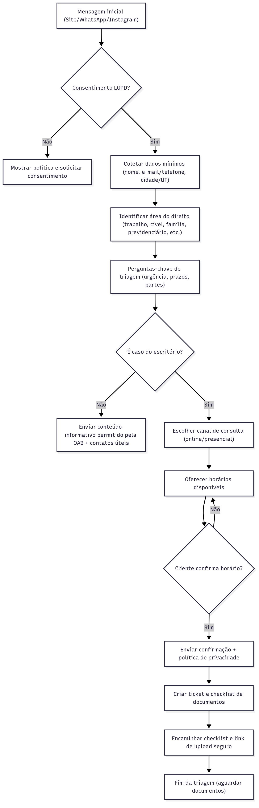
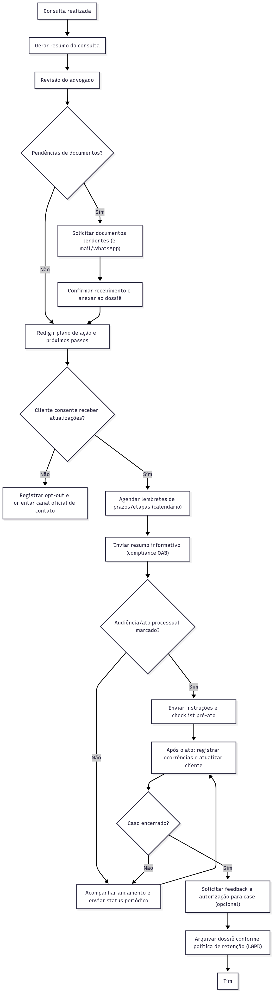
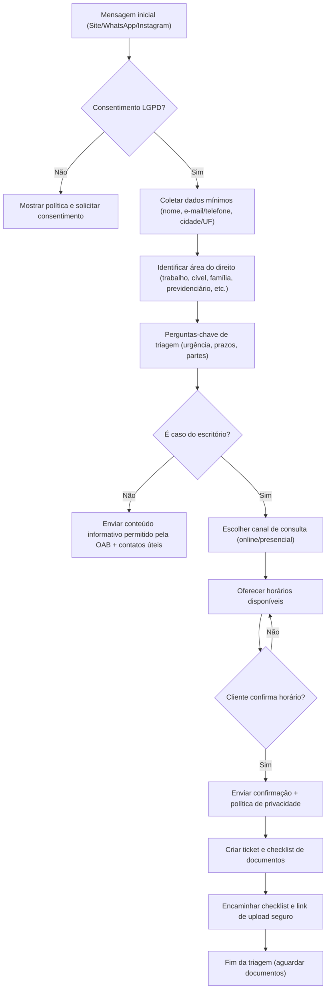
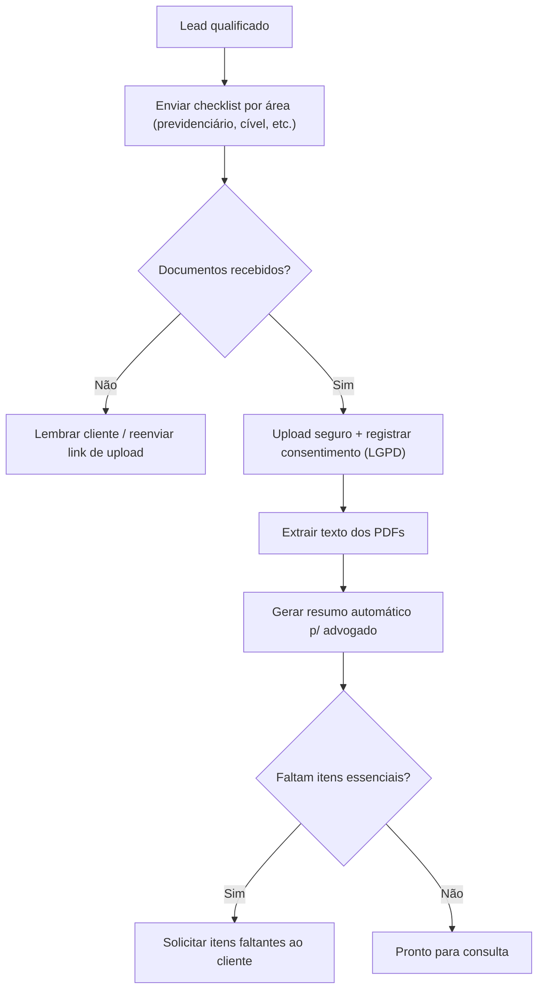
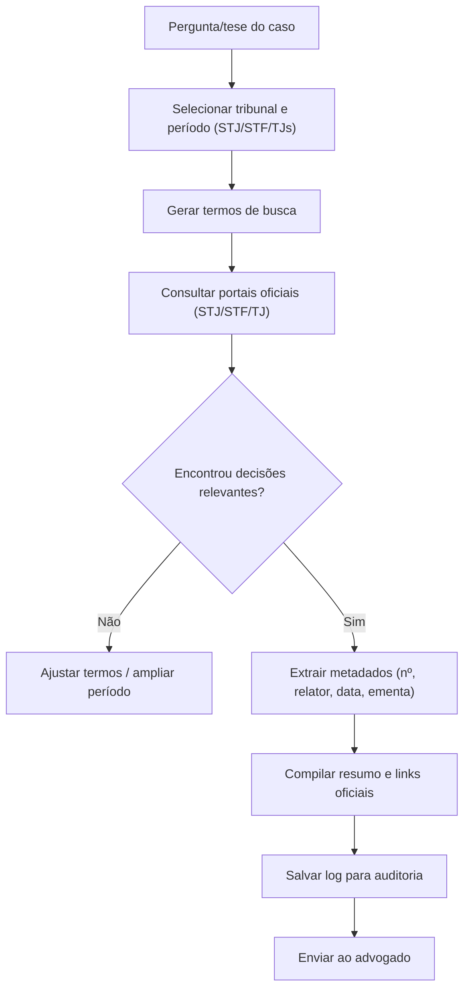
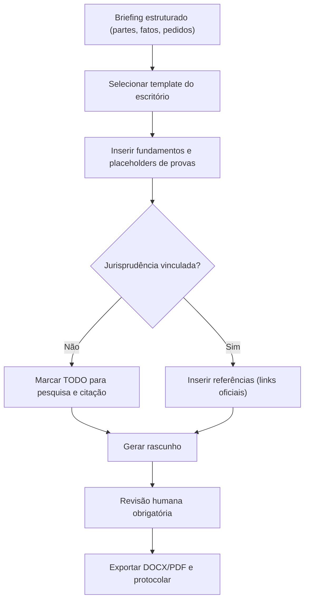
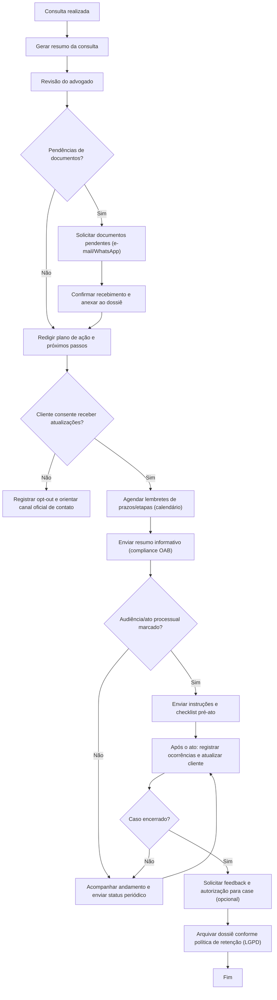

# Fluxos do Agente – Escritório de Advocacia

## 📁 Imagens (PNG/SVG)
> Os arquivos ficam na pasta `assets/`. Ajuste os nomes se estiverem diferentes no seu repositório.

### Triagem (imagem)


### Follow-up (imagem)


---

## 🧩 Diagramas (Mermaid)
> Para renderizar, cada diagrama deve estar dentro de um bloco cercado **```mermaid** e fechar com **```**. (O GitHub recomenda também uma linha em branco antes/depois do bloco.) 

### 1) Atendimento / Triagem detalhado

### 2) Intake (pré-consulta, LGPD e documentos)

### 3) Pesquisa de jurisprudência (com links oficiais)

### 4) Geração de petição (rascunho + revisão humana)

### 5) Follow-up pós-consulta e relacionamento

